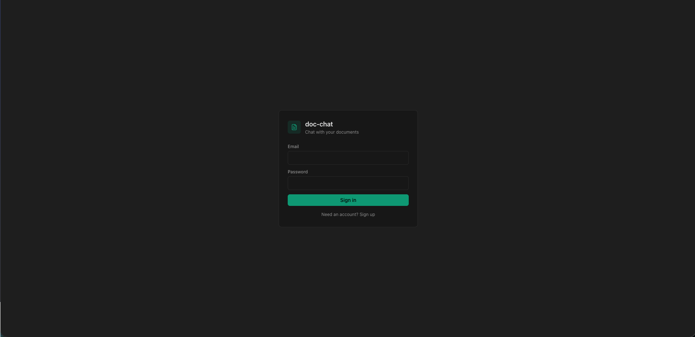
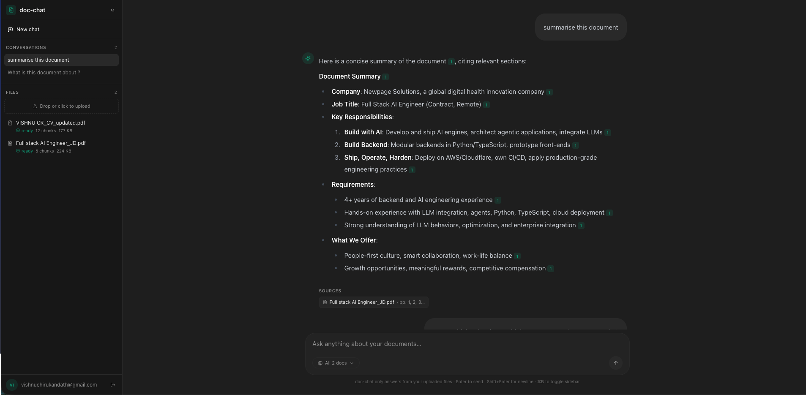

# doc-chat

Upload PDFs or text files, ask questions, and get answers that cite the exact
page they came from. Multi-user, streaming, with hybrid (dense + lexical)
retrieval, an eval harness, and a one-command Docker run.

FastAPI
React
Vite
TypeScript
Supabase
PostgreSQL
NVIDIA NIM

- 🔗 **Live demo:** *coming soon* 
- 🎥 **Video walkthrough:** *coming soon*

## Screenshots

<p align="center">
  
  
</p>


## Quick start

You need a Supabase project (free tier) and an NVIDIA NIM API key (free tier —
[https://build.nvidia.com](https://build.nvidia.com)).

```bash
# Configure env — one file per app (used for both local dev and docker compose)
cp backend/.env.example  backend/.env       # SUPABASE_*, NVIDIA_API_KEY, DATABASE_URL
cp frontend/.env.example frontend/.env      # VITE_SUPABASE_*, VITE_API_BASE_URL

# Backend + migrations
cd backend
uv sync --extra dev
.venv/bin/alembic upgrade head

# Run it (two terminals)
uv run fastapi dev                              # → http://localhost:8000
cd ../frontend && npm install && npm run dev    # → http://localhost:5173

# ...or the whole stack in one container
docker compose up --build                       # → http://localhost:8080
```

Tests and eval:

```bash
cd backend && .venv/bin/pytest -q
.venv/bin/python -m eval.run_eval --dataset eval/dataset.example.jsonl --user-id <your-uuid>
```

Schema changes go through Alembic (`make -C backend migration name="..."` →
fill in the revision → `make migrate`). Never run SQL directly against the DB.

## How it works

A React frontend, a FastAPI backend, and Supabase (Postgres + pgvector, Auth,
Storage). The chat and embedding models are served over an OpenAI-compatible
API — NVIDIA NIM by default, but any OpenAI-spec-compatible provider works.

- **On upload:** the file is parsed, chunked (token-aware, never crossing a page
boundary), embedded, and stored as `pgvector` rows. Ingestion runs in the
background while the UI polls for status.
- **On chat:** the question is embedded and run through a single Postgres
function that does vector + lexical search and fuses them with Reciprocal Rank
Fusion. The top chunks are expanded with their neighbours, rendered as
numbered context blocks, and streamed through the model over SSE.
- **Every answer carries `[n]` citations** that anchor back to a page.

**→ Diagrams and request flows: [docs/architecture.md](docs/architecture.md)**

## Features

- **Hybrid retrieval** — dense + lexical search fused with Reciprocal Rank Fusion inside a single Postgres function, so the indexes are used directly with no merging in Python.
- **Citations that can't be faked** — the frontend drops any `[n]` marker that isn't in the returned source set, so a hallucinated citation never lights up.
- **Auth & tenant isolation** — JWTs verified locally; each tenant's data is strictly scoped, with RLS on as defence in depth.
- **Page-bounded chunking** — chunks never cross a page boundary, which keeps citation page numbers honest.
- **An eval harness, not just tests** — `backend/eval/` scores retrieval (recall@k, MRR) and an answer probe, so chunking/retrieval changes can be measured rather than eyeballed.
- **Streaming answers** — tokens stream to the UI over SSE as the model generates, with citation chips appearing up front.
- **Clean, minimalist UI** — a focused chat interface with a document sidebar and a sources panel; no clutter, nothing to configure to start asking questions.
- **Multi-stage Docker builds** — both services build in a heavy toolchain stage and ship from a slim runtime image: smaller images, smaller attack surface.

**→ Full reasoning (chunking, embedding/LLM choice, retrieval, prompt,
guardrails, observability, trade-offs): [docs/decisions.md](docs/decisions.md)**

## What's next

In rough priority: a **cross-encoder reranker** between retrieval and
generation (biggest expected quality win); a **real eval set** with an
LLM-judge for faithfulness and CI gates; **anchored citation highlights** that
open the source PDF to the right span; moving **ingestion onto a queue + worker**
instead of in-process background tasks; and **server-side query rewriting** for
better multi-turn retrieval.

## Possible improvements

Bigger bets, beyond the near-term roadmap above:

- **Agentic RAG.** Replace the deterministic retrieve-then-generate pipeline
with a tool-calling loop, so the model decides *when* and *what* to fetch —
issuing follow-up searches, reading more of a document on demand, and
managing its own context instead of being handed a fixed top-k.
- **Document preview + traceable citations.** Render the source PDF in-app and
let a citation jump back to the exact span it came from (anchored highlights),
so every claim is one click from its evidence.
- **Mermaid diagram support.** Render Mermaid blocks in answers (and verify
whether the current renderer already passes them through).
- **Advanced parsers + more file types.** Swap pypdf for Docling or LlamaParse
for better layout/table extraction, and support formats beyond PDF (docx,
html, markdown, etc.).
- **Summarize history instead of dropping it.** Rather than truncating to the
last 8 turns, summarize older turns and keep that summary in context.
- **Long-term memory.** Persist durable facts across conversations so the
assistant carries context between sessions.
- **Dedicated ingestion worker.** Move parsing/embedding off the API process
onto a queue + dedicated worker, so uploads scale independently, survive
restarts, and can be retried — the ingestion fn already takes `document_id` +
`user_id`, so only the dispatch changes.
- **Revisit a framework when the pipeline grows.** This is deliberately
framework-light today (see [docs/decisions.md](docs/decisions.md)) because the
flow is simple enough to own directly. If the pipeline gets meaningfully more
complex — agentic loops, many tools, branching retrieval — it's worth
re-evaluating a framework like LangChain or LlamaIndex to manage that
orchestration, rather than hand-rolling it.

## Deployment

**Today:** both the frontend and backend run on Netlify's free tier, and the
whole stack is containerised (`docker-compose.yml`, one image for the whole
app). Supabase provides Postgres + pgvector, Auth, and Storage as managed
services.

**Productionizing on a hyperscaler.** Because the app is already containerised,
the path to AWS / GCP / Azure / Cloudflare is mostly about *where* the container
runs and *what* sits around it:

- **Compute.** Start with a serverless container runtime — **GCP Cloud Run** or
**AWS ECS (Fargate)** — which gives autoscaling, scale-to-zero, and HTTPS with
almost no ops overhead. Reach for **Kubernetes (GKE / EKS / AKS)** only if
other factors justify it (multi-service mesh, complex networking, existing
k8s estate); it's more control at the cost of more to operate.
- **Data.** It currently runs on **Supabase Postgres**, which is standard
Postgres — so it migrates cleanly to **Cloud SQL**, **Aurora / RDS**, or
**Azure Database for Postgres**, all of which support the `pgvector`
extension. Supabase itself also scales, so the move is only needed when other
factors call for it. Object storage (uploads) → **GCS / S3 / Azure Blob**.
- **Ingestion off the request path.** Move parsing/embedding from in-process
background tasks to a **queue + worker** (Cloud Tasks/Pub-Sub, SQS, or a
managed broker) so uploads scale independently of the API and survive
restarts.
- **Edge & delivery.** Serve the frontend from a CDN (**Cloudflare**, CloudFront,
Cloud CDN); terminate TLS and apply WAF / rate limiting at the edge.
- **Scale & resilience.** Horizontal autoscaling on the stateless API,
connection pooling (PgBouncer) in front of Postgres, tuned `ivfflat`/HNSW
indexes as the corpus grows, and secrets in a managed store (Secrets Manager /
Secret Manager / Key Vault) rather than env files.
- **Operate it.** Centralised logs/metrics/traces (the app already uses
`structlog`), health checks, and CI/CD that runs migrations on deploy

## Known limitations

- **Scanned PDFs aren't OCR'd** — pypdf returns empty text and the doc becomes a
0-chunk `ready` document. Should detect and either OCR or fail loudly.
- **Lexical search is English-only** (`english` text-search config); other
languages still work via dense vectors but lose the lexical signal.
- **No dedup** — the same file uploaded twice produces two documents.
- **Retrieval isn't conversation-aware.** Each turn retrieves on the raw
question text — there's no query rewriting, so a follow-up that leans on
earlier context ("what about the second one?") retrieves poorly. The model
still sees the last 8 turns of history, but the *retrieval* step doesn't.
Server-side query rewriting (on the roadmap) is the fix.
- **History older than 8 turns is dropped, not summarized.** Fine for typical
Q&A, weaker for long multi-thread chats.
- **No rate limiting and no transparent retry** on NIM's free-tier bursts — the
error surfaces inline; the user can retry.

## Development & AI tooling

AI-first development: all the code in this repository was generated with Claude Code. The architecture and technology were decided first, and Claude was used as a junior engineer to fill in the well-defined stretches.

The committed `[CLAUDE.md](./CLAUDE.md)` and `[.claude/](./.claude/)` directory
are what make that repeatable — short invariants, an allow-list of safe
commands, `/check` and `/eval` slash commands, and focused review subagents.

**Fine-grained control over what the agent can run.**
[`.claude/settings.json`](./.claude/settings.json) gates every Bash command
through explicit allow/deny lists — read-only commands (`ls`, `grep`, `git
diff`, …) run without prompting, while destructive ones (`rm -rf`, `git push
--force`) and reads of any `.env*` file are hard-denied. A `PreToolUse` hook,
[`.claude/hooks/guard-env.sh`](./.claude/hooks/guard-env.sh), backstops that by
blocking any Bash command that touches a `.env` file, so secrets never round-trip
through the model's context.

**Where this workflow can go further** (on a team, with more time):

- **Shared configs + documented best practices.** Promote the `CLAUDE.md` /
`.claude/` setup into shared, version-controlled team configs so everyone
works against the same invariants, commands, and subagents.
- **Plan before code.** Use Claude in high-effort plan mode, breaking the work
down feature by feature and reviewing the plan before any code is written —
cheaper to fix a plan than a diff.
- **Test-first review.** Have the model write tests first, review those, then
the implementation — so review starts from "what should this do?" not "does
this look right?", and every generated change lands against a check.

