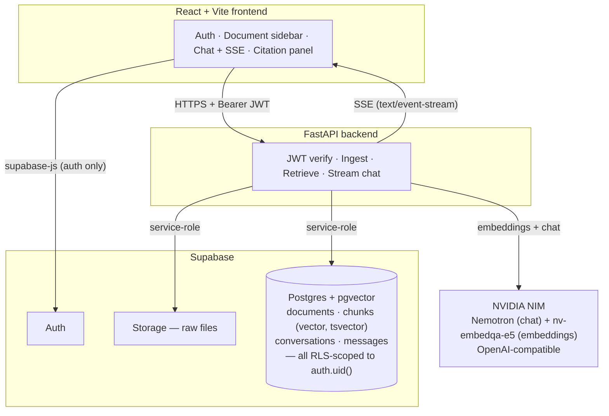
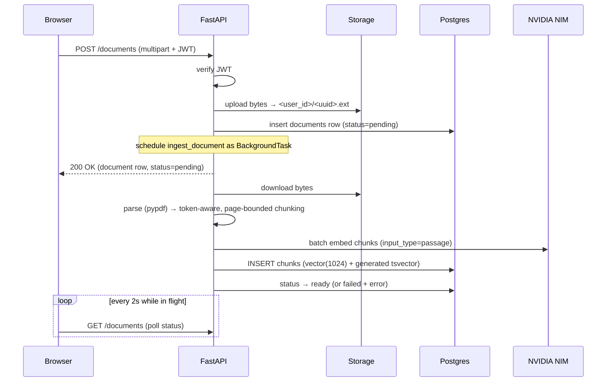
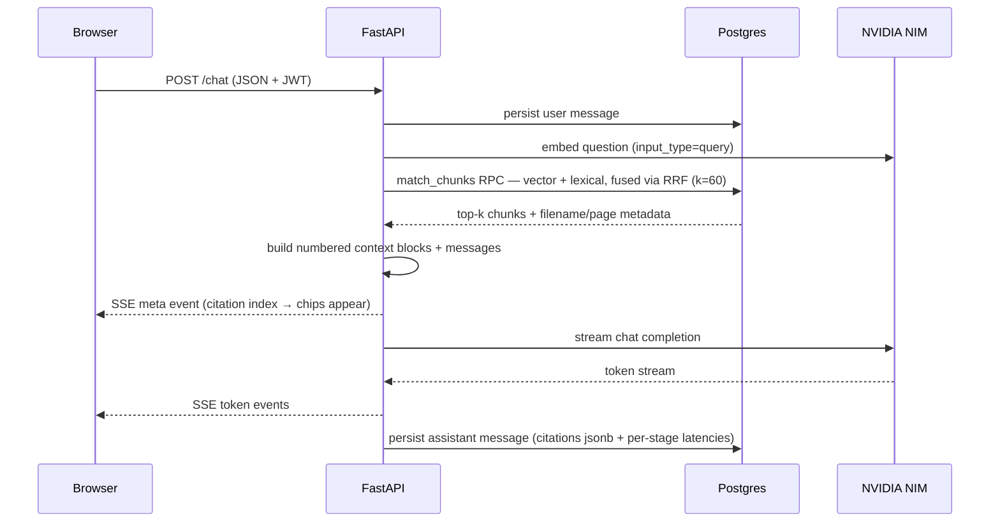

# Architecture

Three tiers: a React frontend, a FastAPI backend, and Supabase (Postgres +
pgvector, Auth, Storage). NVIDIA NIM serves both the chat model and the
embedding model over an OpenAI-compatible API.

The frontend talks to Supabase Auth directly (login only) and to the backend
for everything else. The backend is the only thing that touches the database
and storage, using a service-role key — so every query carries an explicit
`user_id` filter derived from the verified JWT. That filter is the tenant
boundary.

## Uploading a document

## Chatting

